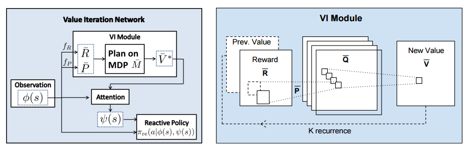

# [Value Iteration Networks](https://arxiv.org/abs/1602.02867) in PyTorch

> Tamar, A., Wu, Y., Thomas, G., Levine, S., and Abbeel, P. _Value Iteration Networks_. Neural Information Processing Systems (NIPS) 2016

This repository contains an implementation of Value Iteration Networks (VIN) in PyTorch based on the original [Theano implementation](https://github.com/avivt/VIN) by the authors and the [TensoFlow implementation](https://github.com/TheAbhiKumar/tensorflow-value-iteration-networks) by [Abhishek Kumar](https://github.com/TheAbhiKumar/tensorflow-value-iteration-networks).

VIN won the Best Paper Award at NIPS 2016. 



## Dependencies
* Python 2.7
* PyTorch 
* SciPy >= 0.18.1 (to load the data)

## Datasets

- The datasets is from the [author's repository](https://github.com/avivt/VIN/tree/master/data). This repository contains the 8x8 GridWorld dataset for convenience and its small size.
- utils.py and data.py are from [Abhishek Kumar's repository](https://github.com/TheAbhiKumar/tensorflow-value-iteration-networks)

## Training

```
python train_main.py
```

Several arguments can be set in train_main.py like learning rate. Please check train_main.py for details.

```
python train_main.py --lr 0.001
```

## References

* [Value Iteration Networks on arXiv](https://arxiv.org/abs/1602.02867)
* [Aviv Tamar's (author) implementation in Theano](https://github.com/avivt/VIN)
* [Abhishek Kumar's implementation in TensorFlow](https://github.com/TheAbhiKumar/tensorflow-value-iteration-networks).
